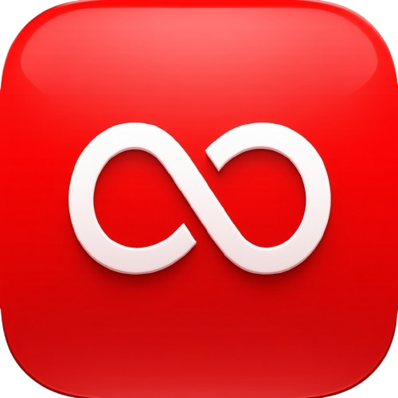

<div align="center">
  
  
  # QuickDL – YouTube Video Downloader

  **Fast. Simple. Ad-Free.**
  
  A built-for-speed YouTube video downloader powered by **Flask** and **Vanilla JS**.
  
  
  
  
  
</div>

---

## 📖 Overview

**QuickDL** is a professional, high-performance open-source YouTube video downloader. It is designed to provide a clean, ad-free, and privacy-focused alternative to generic online downloaders. 

Built on the robust **yt-dlp** engine and a sleek **Flask** backend, QuickDL allows anyone to host their own downloader locally or in the cloud. We focus on simplicity, speed, and standard web practices to ensure the best user experience.

---

## ⚖️ Open Source & Standard

This project follows standard open-source conventions:
- **Privacy First:** No user data collection or tracking.
- **Transparency:** Fully open-source code for community audit.
- **Standards:** Uses Semantic HTML5, CSS Variables, and standard RESTful API patterns.
- **MIT Licensed:** Free to use, modify, and distribute.

---

## 🚀 Features

- ⚡ **Lightning Fast**: Powered by the robust `yt-dlp` engine.
- 📺 **High Quality**: Downloads up to 1080p Full HD.
- 🎨 **Modern UI**: Clean, responsive, and easy to use.
- 🔒 **Privacy Focused**: No ads, no tracking.
- 📱 **Responsive**: Works seamlessly on desktop and mobile.

---

## 🛠️ Tech Stack

### Backend
- **Python**: Core logic.
- **Flask**: Lightweight web framework.
- **yt-dlp**: Media download engine.

### Frontend
- **HTML5/CSS3**: Responsive layout with Tailwind CSS.
- **Vanilla JavaScript**: Fast, dependency-free interaction.

---

## 📁 Project Structure

```bash
QuickDL/
│
├── static/            # Static assets (images, icons)
├── templates/         # HTML templates (index.html)
├── app.py             # Main Flask Application
├── requirements.txt   # Python Dependencies
├── Procfile           # Deployment command for Render/Heroku
├── render.yaml        # Render Blueprint Configuration
├── README.md          # Documentation
└── LICENSE            # MIT License
```

---

## ⚙️ Installation & Setup

### 1. Clone the Repository
```bash
git clone https://github.com/Akshay-gurav-31/QuickDL-YouTube-Downloader.git
cd QuickDL-YouTube-Downloader
```

### 2. Setup environment
Install dependencies:
```bash
pip install -r requirements.txt
```

### 3. Run Locally
```bash
python app.py
```

### 4. Usage
Open your browser and navigate to:
```
http://localhost:5000
```

---

## ⚠️ Disclaimer

This project is intended for **educational and personal use only**. Downloading copyrighted content without permission may violate YouTube’s Terms of Service. The developer is not responsible for any misuse of this software.

---

## 👨‍💻 Developed By

**Akshay Gurav**
[GitHub](https://github.com/Akshay-gurav-31)

---

<div align="center">
  <sub>© 2026 QuickDL. Licensed under MIT.</sub>
</div>
